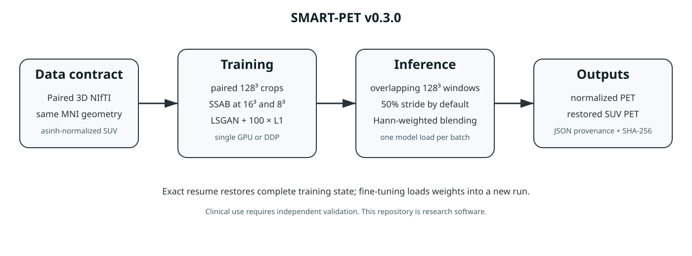

# SMART-PET

**Production-grade 3D training, fine-tuning, evaluation, and whole-volume inference for paired brain PET restoration.**



SMART-PET v0.3.0 modernizes the published self-similarity-aware GAN concept with strict NIfTI geometry checks, deterministic paired-patch training, one-process-per-GPU DDP, exact checkpoint continuation, explicit fine-tuning, batch inference, and fixed-mask SUV evaluation.

> Research software only. The current baseline was selected on a validation split and is not an independently tested clinical model.
>
> **License:** CC BY-NC-SA 4.0. Commercial use is prohibited.

## Key commands

```text
smartpet-validate-manifest   validate paired NIfTI geometry and intensity domain
smartpet-train               train, exactly resume, or fine-tune
smartpet-infer               infer one whole volume
smartpet-infer-batch         infer a CSV-defined cohort with one model load
smartpet-evaluate            compute fixed-mask SUV metrics
smartpet-audit-checkpoint    audit a full training checkpoint
smartpet-export-weights      export inference-only generator weights
smartpet-audit-weights       audit inference-only generator weights
smartpet-audit-inference     audit an output NIfTI
```

## Installation

Install a CUDA-enabled PyTorch build appropriate for the system, then:

```bash
git clone <repository-url>
cd SMART-PET
python -m pip install -e '.[dev]'
pytest
```

No code downloads model weights at runtime.

For an offline cluster with dependencies already installed:

```bash
python -m pip install --no-build-isolation --no-deps -e .
bash scripts/validate_release.sh
```

## Data CSV templates

Training and validation use:

```csv
subject_id,source_path,target_path
train-001,/data/lowdose_normalized.nii.gz,/data/standard_normalized.nii.gz
```

Batch inference uses:

```csv
subject_id,input_path,normalized_output,suv_output
case-001,/data/lowdose_suv.nii.gz,/outputs/prediction_normalized.nii.gz,/outputs/prediction_suv.nii.gz
```

Complete templates are under `examples/`. Patient data and institution-specific manifests are intentionally excluded.

## Validate data

```bash
smartpet-validate-manifest \
  --manifest /data/train.csv \
  --mni-reference /data/reference.nii.gz
```

Every source and target must be a finite scalar 3D NIfTI with the same canonical shape, affine, and voxel spacing as the reference.

## Train from scratch

Edit `configs/train_from_scratch.json`, then run on one GPU:

```bash
smartpet-train --config configs/train_from_scratch.json --backend single
```

Or on multiple GPUs on one node:

```bash
torchrun --standalone --nproc-per-node=2 -m smartpet.cli.train \
  --config configs/train_from_scratch.json --backend ddp
```

`batch_size` is per rank. AMP `auto` uses BF16 when supported, otherwise FP16; CPU execution uses FP32.

## Continue an interrupted run exactly

```bash
smartpet-train \
  --config /run/config.json \
  --resume /run/checkpoints/last.pt \
  --set epochs=50
```

Exact resume restores both networks, optimizers, schedulers, batch position, metric accumulators, and rank-specific RNG state. Incompatible continuation is rejected.

## Fine-tune into a new run

```bash
smartpet-train \
  --config configs/finetune.json \
  --init-checkpoint /models/best.pt \
  --train-csv /data/new_train.csv \
  --val-csv /data/new_val.csv \
  --mni-reference /data/reference.nii.gz \
  --out-dir /runs/new_finetune
```

Fine-tuning requires a full checkpoint containing both trained networks. It resets optimizers, schedulers, progress, and RNG state. Inference-only weights are rejected, and the parent checkpoint hash is recorded.

## Whole-volume inference

```bash
smartpet-infer \
  --checkpoint /models/best.pt \
  --input /data/lowdose_suv.nii.gz \
  --input-domain suv \
  --mni-reference /data/reference.nii.gz \
  --normalized-output /outputs/prediction_normalized.nii.gz \
  --suv-output /outputs/prediction_suv.nii.gz
```

Inference covers the complete image with overlapping 128³ windows and Hann-weighted blending. Normalized and SUV outputs come from the same forward pass.

## Batch inference

```bash
smartpet-infer-batch \
  --manifest examples/inference_manifest.csv \
  --checkpoint /models/best.pt \
  --mni-reference /data/reference.nii.gz \
  --input-domain suv
```

## Baseline validation result

Primary evaluation used inverse-transformed SUV and a fixed external whole-brain mask over all 103 validation subjects:

| Model | SUV MAE ↓ | SUV NRMSE ↓ | SUV PSNR ↑ | SUV SSIM ↑ |
|---|---:|---:|---:|---:|
| D10 input | 0.26746 | 0.08477 | 28.454 dB | 0.87145 |
| **Epoch 4** | **0.20008** | **0.06253** | **31.077 dB** | **0.92657** |
| Epoch 34 | 0.21412 | 0.06747 | 30.379 dB | 0.91629 |

The earlier complete-grid result of 37.55 dB included substantial background and is therefore not directly comparable. It is retained as a secondary engineering metric, not the primary brain PET result.

## Attention configuration

The baseline uses **combined SSAB3D**, consisting of axial self-attention, similarity attention, and channel-spatial attention. `attention_levels: [2, 3]` places SSAB blocks at the 16³ and 8³ encoder feature maps for a 128³ input. It is not a standalone “SAM4” model.

## Documentation

- [Data contract](docs/DATA.md)
- [Training and exact continuation](docs/TRAINING.md)
- [Fine-tuning](docs/FINETUNING.md)
- [Inference](docs/INFERENCE.md)
- [Checkpoint contract](docs/CHECKPOINTS.md)
- [Legacy checkpoint conversion](docs/LEGACY_CHECKPOINT_CONVERSION.md)
- [Reproducibility assets](docs/REPRODUCIBILITY.md)
- [Evaluation](docs/EVALUATION.md)
- [Changes from the paper](docs/CHANGES_FROM_PAPER.md)
- [Model card](docs/MODEL_CARD.md)
- [Offline GitHub release](docs/GITHUB_RELEASE.md)
- [Release checklist](docs/RELEASE_CHECKLIST.md)
- [Release validation status](RELEASE_VALIDATION.md)

## Citation

Please cite the published SMART-PET article described in `CITATION.cff`. The paper and supplementary material are not redistributed in this repository.

## License

SMART-PET is licensed under **CC BY-NC-SA 4.0**. Commercial use is prohibited. See `LICENSE`.

## Reproducibility assets

The pretrained inference checkpoint, exact MNI preprocessing reference, fixed
whole-brain evaluation mask, SHA-256 manifest, and third-party notices are
available in the
[SMART-PET v0.3.0 reproducibility assets folder](https://drive.google.com/drive/folders/1XqEI6W30OsrWusMycX0QB8E8DoFURhWh?usp=drive_link).

Access is currently restricted to authorized reviewers. The repository does
not automatically download these files. The private mirror is temporary; the
public release will use an immutable citable archive and a Git-tracked SHA-256
manifest.

See [Reproducibility assets](docs/REPRODUCIBILITY.md) for the complete contract.
