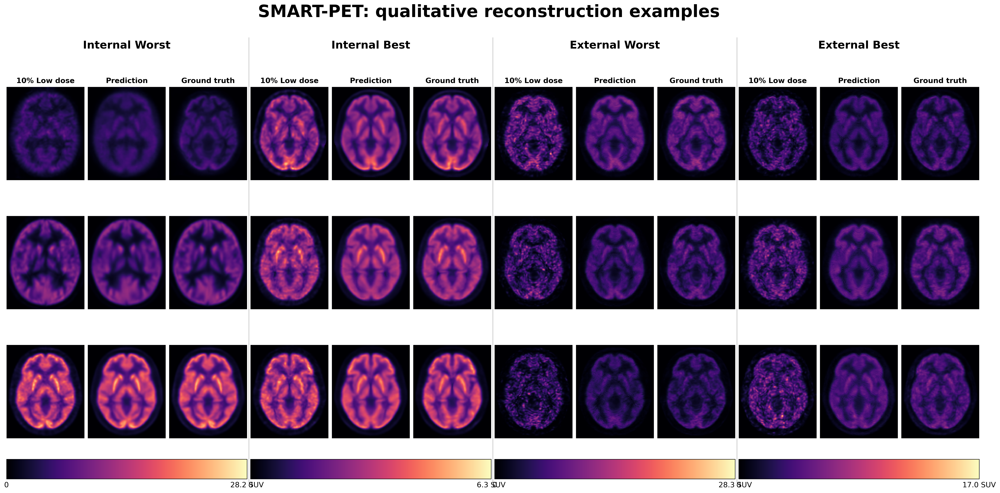

# SMART-PET

**SMART-PET reconstructs standard-dose brain PET from 10% low-dose PET using a self-similarity-aware 3D generative model.**



[**Published paper**](https://www.frontiersin.org/journals/nuclear-medicine/articles/10.3389/fnume.2024.1469490/full) ·
[**Software**](https://github.com/ConfidenceRaymond/SMART-PET) ·
[**Public reproducibility assets**](https://drive.google.com/drive/folders/1XqEI6W30OsrWusMycX0QB8E8DoFURhWh?usp=drive_link)

> **Research software.** SMART-PET is not a clinical diagnostic device.
>
> **License:** CC BY-NC-SA 4.0. Commercial use is prohibited.

## Overview

SMART-PET is a 3D PET restoration framework for recovering standard-dose brain PET from low-dose PET. The current software extends the 2024 method with a reproducible external preprocessing pathway, canonical MNI geometry checks, overlapping 3D patch inference, single- and multi-GPU training, explicit fine-tuning, model auditing, and fixed-mask quantitative evaluation.

The network receives PET images only. Body weight, injected activity, timing, age, sex, scanner, and tracer are **not model inputs**. Some metadata are required only when external activity-concentration images must be converted to SUVbw.

```text
PET images
    ↓
prepare to canonical MNI SUV / normalized MNI SUV
    ↓
validate geometry and manifests
    ↓
pretrained inference
       or
training / fine-tuning
    ↓
whole-volume prediction
    ↓
audit + fixed-mask evaluation
```

## Quick start

### 1. Create an isolated environment

The easiest repository-local setup is:

```bash
git clone https://github.com/ConfidenceRaymond/SMART-PET.git
cd SMART-PET
bash scripts/setup_environment.sh --with-excel --assets inference
source .venv/bin/activate
```

This creates `.venv`, installs SMART-PET with the tested preprocessing constraints, installs optional Excel metadata support, downloads the **inference** asset profile, and verifies the pinned SHA-256 values.

For Alliance Canada / Narval, create the environment on an **internet-enabled login node** using the validated HPC profile:

```bash
bash scripts/setup_environment.sh --alliance --with-excel
source scripts/activate_alliance.sh
```

The clean-room v0.3.1 external-user test passed on Narval with Python 3.11.4, PyTorch 2.6.0+computecanada, CUDA runtime 12.2, and an NVIDIA A100-SXM4-40GB. PyTorch is platform-specific; other systems should use a PyTorch build appropriate for their hardware.

Alliance compute nodes may not have outbound internet. Download public assets on an internet-connected machine (or an allowed login node), copy the `resources/` tree to the cluster, then run `smartpet-download-assets --verify-only` on Narval.

For a manual installation, prefer a normal non-editable install:

```bash
python -m venv .venv
source .venv/bin/activate
python -m pip install -c requirements/preprocessing-tested.txt .
```

Development only:

```bash
python -m pip install -e '.[dev,excel,assets]'
pytest
ruff check .
```

See [External preprocessing environment](docs/PREPROCESSING_ENVIRONMENT.md) for the tested package stack, Alliance isolation details, and ANTs setup.

### 2. Public assets

The canonical public MNI reference is:

```text
resources/templates/csymT.nii.gz
SHA-256: d28d312d3c895c226dbd61947b77691c6d850396c035015399bd4cfdeed4c291
```

The fixed evaluation mask is:

```text
resources/templates/MNI152_T1_1mm_brain_mask.nii.gz
SHA-256: 274b41c4cf787ada4ce683524301ee052d1ef64b208569c05ce7e9c00717404e
```

The recommended parent inference model is:

```text
resources/weights/smartpet_g001_parent_v0.3.1.pt
SHA-256: f26b89db433368167bb67242d0ed2e5351651a2155a92f41f6fce991649f91b0
```

Download and verify only the inference assets:

```bash
python -m pip install '.[assets]'
smartpet-download-assets --profile inference --output-dir resources
```

Fine-tuning additionally needs the full parent checkpoint:

```bash
smartpet-download-assets --profile finetune --output-dir resources
```

The repository-pinned checksum list is [`docs/PUBLIC_ASSET_SHA256_v0.3.1.txt`](docs/PUBLIC_ASSET_SHA256_v0.3.1.txt). Do not rely on an older checksum file solely because it is present in a mutable mirror.

Audit the downloaded parent weights before inference:

```bash
smartpet-audit-weights \
  --weights resources/weights/smartpet_g001_parent_v0.3.1.pt \
  --expected-sha256 f26b89db433368167bb67242d0ed2e5351651a2155a92f41f6fce991649f91b0
```

See [Public assets and integrity](docs/PUBLIC_ASSETS.md).

### 3. Prepare data

SMART-PET accepts **scalar 3D NIfTI PET**. Dynamic 4D PET is not accepted directly; first construct a scientifically documented static 3D image from the intended frames/window. Do not label image-space Poisson corruption or arbitrary frame selection as true count thinning.

Four preprocessing entry points are supported:

| Input kind | Starting data | Processing performed |
|---|---|---|
| `raw_activity` | calibrated activity PET outside MNI space | shared target-estimated ANTs registration → SUVbw → asinh |
| `mni_activity` | calibrated activity PET already in MNI space | SUVbw → asinh |
| `mni_suv` | SUVbw PET already in MNI space | asinh |
| `mni_suv_normalized` | SMART-PET normalized MNI SUV | validation and staging |

For MNI SUV images, the metadata can be minimal:

```csv
subject_id,source_image_path,target_image_path
sub-001,raw/sub-001/lowdose.nii.gz,raw/sub-001/standarddose.nii.gz
```

Run:

```bash
smartpet-prepare-external \
  --metadata-file data/metadata.csv \
  --data-root data \
  --output-root data/prepared \
  --mni-reference resources/templates/csymT.nii.gz \
  --input-kind mni_suv
```

For calibrated activity PET, use [`examples/external_activity_metadata_template.xlsx`](examples/external_activity_metadata_template.xlsx) or the CSV template under [`manifests/templates/`](manifests/templates/). The bundled workbook reads `Raw_Activity_Template` by default; use `--metadata-sheet` for another sheet. `smartpet-prepare-external --help` lists the required columns, units, count-scaling modes, and decay-reference semantics.

`raw_activity` additionally requires the external ANTs commands:

```text
antsRegistrationSyNQuick.sh
antsApplyTransforms
```

On Alliance/Narval:

```bash
module load ants/2.6.5
```

On other systems, install ANTs from the official ANTsX project and ensure its `bin` directory is on `PATH`. MNI-domain inputs do not require ANTs registration.

See [Data preparation](docs/DATA_PREPARATION.md).

### 4. Validate model-facing data

`smartpet-prepare-external` writes:

```text
data/prepared/manifests/pairs_normalized.csv
```

Training/validation manifests contain:

```csv
subject_id,source_path,target_path
sub-001,/data/prepared/normalized/source/sub-001_source_norm.nii.gz,/data/prepared/normalized/target/sub-001_target_norm.nii.gz
```

Keep every scan from one participant in the same split. Validate before allocating a GPU:

```bash
smartpet-validate-manifest \
  --manifest data/train.csv \
  --other-manifest data/validation.csv \
  --mni-reference resources/templates/csymT.nii.gz
```

SMART-PET canonicalizes valid NIfTI orientation to RAS using the affine, then checks the canonical shape, affine, and voxel spacing against the canonicalized MNI reference. Orientation canonicalization is **not anatomical registration**; native-space data must use the preprocessing registration pathway first.

### 5. Run G0.01-parent inference

```bash
mkdir -p outputs

smartpet-infer \
  --checkpoint resources/weights/smartpet_g001_parent_v0.3.1.pt \
  --input data/prepared/suv/source/sub-001_source_mni_suv.nii.gz \
  --input-domain suv \
  --mni-reference resources/templates/csymT.nii.gz \
  --suv-output outputs/sub-001_prediction_suv.nii.gz \
  --normalized-output outputs/sub-001_prediction_normalized.nii.gz \
  --metadata-json outputs/sub-001_prediction.json
```

Whole-volume inference uses overlapping 128 × 128 × 128 patches and blends them into a single MNI volume.

Audit the result:

```bash
smartpet-audit-inference \
  --output outputs/sub-001_prediction_suv.nii.gz \
  --mni-reference resources/templates/csymT.nii.gz \
  --input data/prepared/suv/source/sub-001_source_mni_suv.nii.gz \
  --target data/prepared/suv/target/sub-001_target_mni_suv.nii.gz \
  --json-output outputs/sub-001_prediction_audit.json
```

## Train from scratch

The released G0.01-parent training contract is in:

```text
configs/train_from_scratch.json
```

Single GPU:

```bash
smartpet-train \
  --config configs/train_from_scratch.json \
  --train-csv data/train.csv \
  --val-csv data/validation.csv \
  --mni-reference resources/templates/csymT.nii.gz \
  --out-dir runs/from_scratch \
  --backend single
```

One-node DDP:

```bash
torchrun --standalone --nproc-per-node=2 -m smartpet.cli.train \
  --config configs/train_from_scratch.json \
  --train-csv data/train.csv \
  --val-csv data/validation.csv \
  --mni-reference resources/templates/csymT.nii.gz \
  --out-dir runs/from_scratch \
  --backend ddp
```

`batch_size` is per process. See [Training](docs/TRAINING.md).

## Fine-tune on a new domain

Fine-tuning requires the **full G0.01-parent training checkpoint**, not inference-only weights:

```text
resources/checkpoints/smartpet_g001_parent_v0.3.1_full_checkpoint.pt
SHA-256: 2c974d4196e4514e5a0b877923d6b9b0a0c35ad4b447d06cd73d1bbc7abb8dee
```

```bash
smartpet-train \
  --config configs/finetune.json \
  --init-checkpoint resources/checkpoints/smartpet_g001_parent_v0.3.1_full_checkpoint.pt \
  --train-csv data/train.csv \
  --val-csv data/validation.csv \
  --mni-reference resources/templates/csymT.nii.gz \
  --out-dir runs/finetuned
```

Fine-tuning initializes both trained networks but creates new optimizers, schedulers, progress counters, and RNG streams. See [Fine-tuning](docs/FINETUNING.md).

## Evaluate

The public evaluator reports metrics in a fixed brain mask:

```bash
smartpet-evaluate \
  --prediction outputs/sub-001_prediction_suv.nii.gz \
  --target data/prepared/suv/target/sub-001_target_mni_suv.nii.gz \
  --brain-mask resources/templates/MNI152_T1_1mm_brain_mask.nii.gz \
  --mni-reference resources/templates/csymT.nii.gz \
  --prediction-domain suv \
  --target-domain suv \
  --output-json outputs/sub-001_metrics.json
```

See [Evaluation](docs/EVALUATION.md).

## Public model hierarchy

| Artifact | Intended use |
|---|---|
| `smartpet_g001_parent_v0.3.1.pt` | **Recommended general pretrained inference model** |
| `smartpet_g001_external_adapted_v0.3.1.pt` | Domain-specific adapted inference model |
| `smartpet_g001_parent_v0.3.1_full_checkpoint.pt` | Full parent checkpoint for fine-tuning |
| `smartpet_v0.3.0_epoch4_inference.pt` | Historical v0.3.0 inference artifact |

The external-adapted model is not a universal replacement for the parent. See [Model provenance](docs/MODEL_PROVENANCE.md).

## Documentation

Start here:

- [Public assets and integrity](docs/PUBLIC_ASSETS.md)
- [External preprocessing environment](docs/PREPROCESSING_ENVIRONMENT.md)
- [Data contract](docs/DATA.md)
- [Data preparation](docs/DATA_PREPARATION.md)
- [Training](docs/TRAINING.md)
- [Fine-tuning](docs/FINETUNING.md)
- [Inference](docs/INFERENCE.md)
- [Evaluation](docs/EVALUATION.md)
- [Model card](docs/MODEL_CARD.md)
- [Model provenance](docs/MODEL_PROVENANCE.md)
- [External-user validation](docs/EXTERNAL_USER_VALIDATION.md)
- [External-user correction log](docs/EXTERNAL_USER_CORRECTION_LOG.md)
- [Changes from the 2024 paper](docs/CHANGES_FROM_PAPER.md)

## Citation

If you use SMART-PET, cite the published method:

**SMART-PET**, *Frontiers in Nuclear Medicine* (2024)
DOI: `10.3389/fnume.2024.1469490`

Repository citation metadata are provided in [`CITATION.cff`](CITATION.cff).

## License

SMART-PET is released under **CC BY-NC-SA 4.0**. Commercial use is prohibited. See [`LICENSE`](LICENSE).
